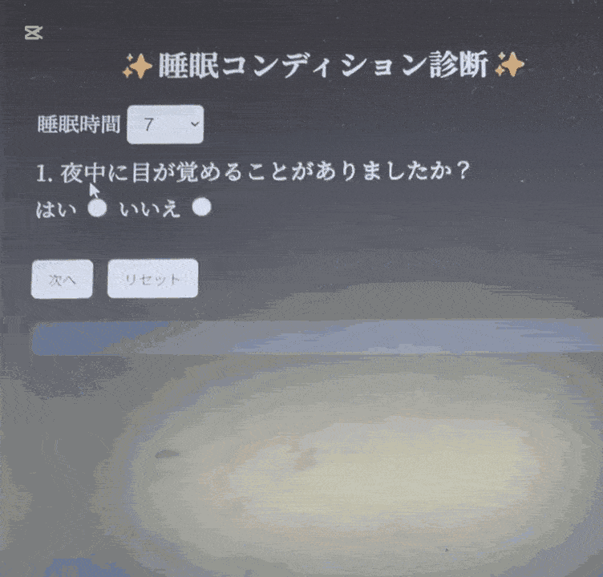

# 🌓 sleep_app – Simple Sleep Type Diagnosis

🌏 Language Switch: [日本語](README.md) | [English](README-en.md)

※Some parts may be hard to read due to translation.
---

---

## 👩‍💻 Technologies Used

  
  
  
  
  
  
  
  

---

## ✨ Overview

sleep_app is a small diagnostic app that returns your sleep type and improvement advice based on your answers to a series of questions.  
User selections are sent to the Flask server as JSON, and aggregated results are displayed on the screen.  

The UI emphasizes a soft, calm atmosphere with minimal navigation to avoid confusion during use.

---

## 🎯 Key Features

| Feature | Description |
|--------|-------------|
| 🕯️ Step-by-Step Questions | Simple UX guiding one question at a time |
| 📊 Server Aggregation | Send selections via JSON and calculate results |
| 📝 Advice Display | Short comments based on sleep type |
| 🎨 Calm UI | Focus on soothing colors and easy interaction |

---

## ⚙️ Setup Instructions

- You can run the app by following these steps:

1. Navigate to your desired folder and clone this repository using the command below.

  Example: If you want to place it on the Desktop:
  
  - `cd %USERPROFILE%\Desktop`

  Clone command (copy and paste into your git terminal):
  
- `git clone https://github.com/shiokuma000/sleep_app.git <your-folder-name>`

2. (Optional but recommended) Create a virtual environment:

- `python -m venv venv`

🖥 **macOS / Linux**

- `source venv/bin/activate`

🖥 **Windows (Command Prompt)**

- `venv\Scripts\activate.bat`

🖥 **Windows (PowerShell)**

- `.\venv\Scripts\Activate.ps1`

3. Install required packages:
- `pip install -r requirements.txt`

4. Start the application using the command line or similar methods.

- **Before running the command, make sure you are in the folder containing the app:**
  
  `cd <your-folder-name>`  

- `python app.py`

- If the following appears in your terminal, you can access the app:
- `* Running on http://127.0.0.1:5000/ (Press CTRL+C to quit)`

5. Open your browser and visit:
- `http://127.0.0.1:5000`

6. Enjoy the sleep diagnosis!
---

## 🚀 How It Works

1. Select your sleep duration (3–11 hours).  
2. Questions are displayed one at a time.  
3. Proceed by choosing “Yes / No” for each question.  
4. Click the “Diagnose” button → JSON is sent to the server  
5. On the Flask side, the following happens:  
   - Aggregate responses  
   - Analyze sleep tendencies  
   - Generate advice  
6. Results are returned in JSON format.  
7. The diagnosis and a small bear are displayed on the screen.  
8. Use “Reset” to start over.

---

## 🔧 Technical Highlights

| Item | Description |
|------|-------------|
| 🗄️ JSON Communication | Lightweight connection between front-end and server |
| 🔍 Validation | Simple checks to prevent input errors |
| 🖥️ Server Processing | Aggregation and evaluation at route `/check` |
| 🎨 UI/UX | Large clickable buttons and calm color scheme |

---

## 🔄 Future Improvements

| Item | Description |
|------|-------------|
| 📈 Improve Accuracy | Adjust questions and weighting |
| 💾 Data Storage | Save past results |
| 🎀 UI Enhancements | Softer nighttime-themed design, more bear comments |

---

## 📁 Project Structure & Screen Flow

- [🪄 Project Structure](PROJECT.md)  
- [🔍 Screen Flow Diagram](docs/sleep.png)

---

## 🚀 Demo

  

※ Click images to enlarge.

---

## 💡 License & Copyright

- This project was created for learning purposes and is not intended for commercial use.  
- Licenses for libraries and tools used belong to their respective authors.

---

🌟 Last Updated: 2025-11-25
