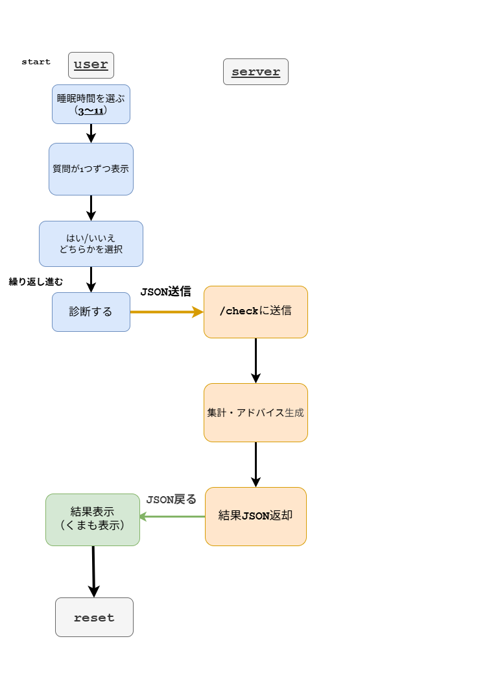

# 😴 sleep_app – シンプル睡眠タイプ診断

🌏 言語切替: （必要であれば追加可能）

---

## 👩‍💻 使用技術

  
  
  
  
  
  
  

---

## ✨ 概要

sleep_app は、質問に答えることで睡眠タイプと改善アドバイスを返す小さな診断アプリです。  
ユーザーの選択肢は Flask サーバーに JSON で送信され、集計結果が画面に表示されます。  

UIは淡く静かな雰囲気を意識し、操作に迷わない最小限の動線で構成しています。

---

## 🎯 主な特徴

| 機能 | 説明 |
|------|------|
| 🕯️ 質問ステップ形式 | 1問ずつ丁寧に進むシンプルUX |
| 📊 サーバー集計 | 選択内容を JSON で送信し結果を算出 |
| 📝 アドバイス表示 | タイプ別に短いコメントを返す |
| 🎨 落ち着いたUI | 静かな色調と操作のしやすさを重視 |

---

## 🚀 使い方の流れ

1. 睡眠時間（3〜11時間）を選ぶ  
2. 質問が 1 つずつ表示  
3. 「はい / いいえ」を選択しながら進む  
4. 「診断する」ボタンでサーバーへ JSON送信  
5. Flask 側で  
   - 回答の集計  
   - 睡眠傾向の分析  
   - アドバイス作成  
6. 結果を JSON 形式で返却  
7. 画面に診断結果と小さなくまを表示  
8. reset で最初に戻る  

---

## 📁 プロジェクト構成

sleep_app 
📕 README.md / .gitignore 
🕯️ static 
🗃️ templates 
💎 app.py 
📝 memo

---

## 🔧 技術的なポイント

| 項目 | 説明 |
|------|------|
| 🗄️ JSON通信 | フロントとサーバー間を軽量に繋ぐ |
| 🔍 バリデーション | 入力不備を避けるため簡易チェック |
| 🖥️ サーバー処理 | ルート `/check` で集計・判定 |
| 🎨 UI/UX | クリックしやすい大きめボタンと静かな配色 |

---

## 🔄 今後の改善予定

| 項目 | 説明 |
|------|------|
| 📈 結果の精度向上 | 質問内容・重み付けの調整 |
| 💾 データ保存 | 過去結果を記録できるようにする |
| 🎀 UI改善 | 夜の雰囲気を強めた柔らかいデザインへ |

---

## 🗂 画面遷移図

---

🌟 最終更新: 2025-11-19
